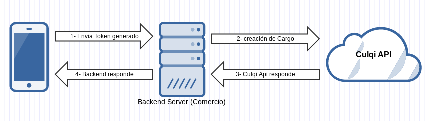

# Culqi Android

**Nota**: Esta biblioteca trabaja con la [v2](https://culqi.com/api/) de Culqi API.

## Tarjetas de pruebas

[Documentación de Tarjetas de prueba](https://docs.culqi.com/#/desarrollo/tarjetas)

## Requisitos

* Android 8.0 o superior.
* Credenciales de comercio Culqi (1).

## Construye tu propio formulario

Si crea su propio formulario de pago, deberá recopilar al menos los números de tarjeta y las fechas de vencimiento de sus clientes. Es probable que también recoger el CVV para evitar el fraude.
Una vez que haya recopilado la información de un cliente, tendrá que intercambiar la información por un token Culqi.

## Creación de Token desde un formulario personalizado

Puede crear tokens utilizando el método utilizando el método de instancia Culqi createToken
Pasando el número de la tarjeta, cvv, la fecha de vencimiento y un correo

```kotlin
val card = Card("411111111111111", "123", 9, 2025, "abc@prueba.com")

val token = Token("pk_test_cbc6c27964d9d3ac")
token.createToken(applicationContext, card, object : TokenCallback {
    override fun onSuccess(token: JSONObject) {
        try {
            token["id"].toString()
        } catch (ex: Exception) {
        }
    }

    override fun onError(error: Exception) {
    }
})
```

## Usando Tokens

El uso de token requiere una llamada de API desde su servidor utilizando su clave de API secreta. (Por razones de seguridad, nunca debe incrustar su clave secreta de API en su aplicación.) El método **createToken** devuelve onSuccess una respuesta en json y onError el error de la petición HTTP

## ¿Cómo Funciona?



1. La aplicación genera un Token utilizando su llave publica y se envía al backend
2. El backend recibe los datos para la creación de un Cargo (Por seguridad, Solo en el backend se  debe utilizar la llave secreta) y es enviado a Culqi API
3. Culqi API envia un respuesta en formato json
4. El backend procesa la respuesta, para luego mostrar el mensaje (exito o error) en la aplicación movil

## Licencia

El código fuente de culqi-android está distribuido bajo MIT License, revisar el archivo [LICENSE](https://github.com/culqi/culqi-java/blob/master/LICENSE).
